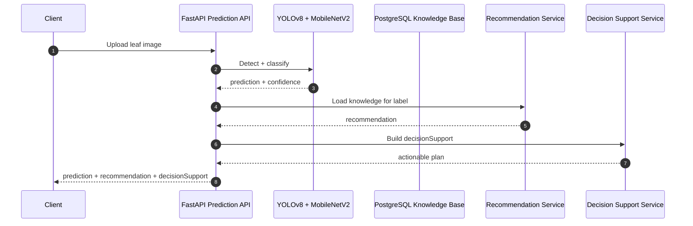

# DurianCare AI Decision Support

## 1. Mục tiêu

Decision Support là lớp quyết định nghiệp vụ nằm trên AI Recommendation Engine.
Lớp này không thay đổi model, không gọi LLM, không dùng dịch vụ ngoài.
Nó biến nhãn dự đoán và khuyến nghị tri thức thành hành động canh tác cụ thể cho nông dân.

## 2. Kiến trúc



## 3. Luồng quyết định

1. Nhận `prediction`, `confidence`, `recommendation`.
2. Xác định `riskLevel`.
3. Sinh các nhóm hành động theo thứ tự ưu tiên:
   - Immediate Actions
   - Biological Treatment Plan
   - Organic Farming Advice
   - Chemical Usage Advice
   - Monitoring Plan
   - Export Readiness Advice
   - Farmer Notes
4. Nếu là `HEALTHY_LEAF`, chỉ trả về hướng dẫn phòng ngừa.
5. Nếu không có recommendation, service vẫn tạo fallback guidance an toàn.

## 4. Rule engine

### 4.1 Xếp hạng rủi ro

- `HEALTHY_LEAF` -> `LOW`
- `severity = CRITICAL` -> `CRITICAL`
- `severity = HIGH` -> `HIGH`
- `severity = MEDIUM` -> `MEDIUM`
- Nếu thiếu recommendation, fallback theo confidence:
  - `confidence < 0.80` -> tối thiểu `MEDIUM`

### 4.2 Thứ tự ưu tiên

1. Prevention
2. Isolation of infected leaves
3. Biological treatment
4. Organic farming
5. Chemical treatment only if necessary
6. Harvest precautions
7. Export precautions

### 4.3 Quy tắc hóa chất

- Không bao giờ để hóa chất là lựa chọn đầu tiên.
- Chỉ gợi ý hóa chất khi KB có treatment hợp lệ.
- Kèm safe usage note và PHI note nếu có.
- Không bịa MRL.

### 4.4 Quy tắc xuất khẩu

- Luôn ưu tiên:
  - Observe PHI before harvest
  - Maintain pesticide records
  - Follow VietGAP practices
  - Verify destination-country residue regulations
  - Prefer biological control
  - Avoid spraying close to harvest

## 5. Files đã thêm / đổi

### New

- `duriancare-ai-service/app/decision/decision_service.py`
- `duriancare-ai-service/app/decision/decision_mapper.py`
- `duriancare-ai-service/app/decision/decision_rules.py`
- `duriancare-ai-service/app/schemas/decision_support.py`
- `duriancare-ai-service/tests/test_decision_service.py`

### Modified

- `duriancare-ai-service/app/api/predict.py`
- `duriancare-ai-service/app/schemas/prediction.py`
- `duriancare-ai-service/main.py`

## 6. API response

`PredictionData` được mở rộng thêm field:

- `decisionSupport`

Ví dụ:

```json
{
  "status": "success",
  "data": {
    "predicted_disease": "LEAF_BLIGHT",
    "confidence": "94.52%",
    "recommendation": { "...": "..." },
    "decisionSupport": {
      "riskLevel": "HIGH",
      "immediateActions": [
        "Cách ly phần lá bị cháy và thu gom lá bệnh nặng ra khỏi vườn."
      ],
      "biologicalPlan": [
        "Biological: Ưu tiên tác nhân đối kháng đã được sàng lọc."
      ],
      "organicPlan": [
        "Organic: Không trồng quá dày; tỉa cành để tăng ánh sáng."
      ],
      "chemicalPlan": [
        "Chỉ dùng hóa chất khi biện pháp phòng ngừa và sinh học không đủ kiểm soát."
      ],
      "monitoringPlan": [
        "Theo dõi theo nhãn Leaf blight và kiểm tra lại sau mỗi đợt mưa hoặc lộc non."
      ],
      "exportReadiness": [
        "Observe PHI before harvest.",
        "Maintain pesticide application records."
      ],
      "farmerNotes": [
        "Kết quả khớp với Tên bệnh (Disease name)."
      ]
    }
  }
}
```

## 7. Ví dụ theo từng nhãn

### `HEALTHY_LEAF`

- `riskLevel`: `LOW`
- Chỉ có:
  - immediate actions phòng ngừa
  - monitoring plan định kỳ
  - export readiness chung
- Không có chemical plan.

### `ALGAL_LEAF_SPOT`

- Tập trung:
  - cách ly lá bị đốm
  - tỉa tán thông thoáng
  - khuyến nghị sinh học và hữu cơ
  - chemical plan chỉ khi bệnh nặng

### `LEAF_BLIGHT`

- Tập trung:
  - thu gom lá bệnh
  - cải thiện thoát nước và thông thoáng
  - sinh học trước, hóa chất sau cùng

### `PHOMOPSIS_LEAF_SPOT`

- Tập trung:
  - vệ sinh vườn
  - giảm nguồn bệnh lưu tồn
  - theo dõi sau mưa và trên lộc mới

### `ALLOCARIDARA_ATTACK`

- Tập trung:
  - giám sát đọt non
  - bảo tồn thiên địch
  - sinh học trước
  - hóa chất chỉ khi cần và có nhãn hợp lệ

## 8. Test coverage

- Healthy leaf
- Disease decision generation
- High-risk disease
- Missing recommendation
- Export advice
- Rule ordering
- Response mapping

## 9. Future extension

- Thêm scorecard theo vùng trồng hoặc mùa vụ.
- Thêm lịch monitoring theo số ngày.
- Thêm template riêng cho từng thị trường xuất khẩu.
- Thêm rule tuning theo severity và confidence nếu cần.

