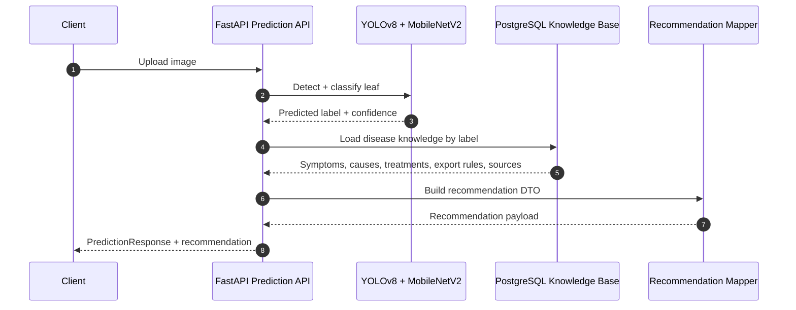

# DurianCare AI Recommendation Engine

## 1. Mục tiêu

Module này mở rộng luồng chẩn đoán bệnh hiện có bằng cách tra cứu **Knowledge Base PostgreSQL** sau khi model trả về nhãn dự đoán.

Mục tiêu:

- Giữ nguyên model AI hiện tại.
- Không thay đổi frontend.
- Không phá vỡ endpoint `POST /api/v1/predict`.
- Bổ sung khuyến nghị nông nghiệp có cấu trúc, dựa trên nguồn đáng tin cậy.

## 2. Kiến trúc runtime



## 3. Thành phần đã thêm

### `app/repositories/knowledge_repository.py`

- Kết nối PostgreSQL bằng `psycopg` pool.
- Đọc các bảng knowledge base theo `disease_code`.
- Trả về bundle dữ liệu đã gom:
  - disease master
  - symptoms
  - causes
  - biological treatments
  - organic treatments
  - chemical treatments
  - recommended chemicals
  - active ingredients
  - harvest intervals
  - export requirements
  - reference sources

### `app/mappers/recommendation_mapper.py`

- Chuyển dữ liệu thô từ repository sang DTO an toàn cho API.
- Gom nested recommendation:
  - chemical treatment
  - recommended products
  - active ingredients
  - harvest intervals

### `app/services/recommendation_service.py`

- Điểm vào nghiệp vụ cho AI service.
- Có cache nội bộ theo `disease_code`.
- Không làm hỏng core prediction nếu knowledge lookup lỗi.

### `app/schemas/recommendation.py`

- DTO đầu ra cho khuyến nghị nông nghiệp.
- Bao gồm:
  - `ReferenceSourceSummary`
  - `KnowledgeLineItem`
  - `ActiveIngredientSummary`
  - `HarvestIntervalSummary`
  - `RecommendedChemicalSummary`
  - `ChemicalTreatmentSummary`
  - `ExportRequirementSummary`
  - `DiseaseRecommendation`

### `app/schemas/prediction.py`

- Bổ sung field:
  - `recommendation: DiseaseRecommendation | None`

### `main.py`

- Khởi tạo `KnowledgeRepository` và `RecommendationService`.
- Gắn vào `app.state`.
- Health endpoint có thêm trạng thái `recommendationReady`.

### `app/api/predict.py`

- Sau khi model trả về nhãn dự đoán, service sẽ tra cứu knowledge base.
- Nếu knowledge base sẵn sàng, response sẽ đính kèm recommendation.
- Nếu lookup lỗi, core prediction vẫn trả về bình thường.

## 4. Mapping dữ liệu

| Table | Vai trò |
|---|---|
| `kb_diseases` | Disease master |
| `kb_disease_symptoms` | Triệu chứng |
| `kb_disease_causes` | Nguyên nhân |
| `kb_biological_treatments` | Biện pháp sinh học |
| `kb_organic_treatments` | Biện pháp canh tác / hữu cơ / phòng ngừa |
| `kb_chemical_treatments` | Hóa học khi cần thiết |
| `kb_recommended_chemicals` | Sản phẩm đề xuất |
| `kb_active_ingredients` | Hoạt chất |
| `kb_recommended_chemical_active_ingredients` | Liên kết sản phẩm - hoạt chất |
| `kb_harvest_intervals` | PHI theo thị trường |
| `kb_export_requirements` | Lưu ý xuất khẩu |
| `kb_reference_sources` | Nguồn tham chiếu |

## 5. Quy tắc nghiệp vụ

- Không tự bịa kiến thức.
- Nếu không có nguồn xác thực, mục đó không xuất hiện trong response.
- `HEALTHY_LEAF` chỉ trả về khuyến nghị phòng ngừa, không có hóa chất.
- Bệnh mức cao có thể có cả:
  - phòng ngừa
  - sinh học
  - hữu cơ
  - hóa học có cảnh báo an toàn
- Khuyến nghị xuất khẩu nhấn mạnh:
  - traceability
  - PHI
  - residue risk
  - kiểm tra nhãn và MRL trước khi đóng gói

## 6. API contract hiện tại

Endpoint dự đoán hiện tại không đổi:

- `POST /api/v1/predict`
- `POST /api/v1/predict/from-s3`
- `POST /api/ai/diagnoses`  *(deprecated)*

Response hiện tại được mở rộng thêm:

```json
{
  "status": "success",
  "data": {
    "predicted_disease": "LEAF_BLIGHT",
    "confidence": "94.52%",
    "recommendation": {
      "disease_code": "LEAF_BLIGHT",
      "severity": "HIGH"
    }
  }
}
```

## 7. Ví dụ response theo từng nhãn

### 7.1 `ALGAL_LEAF_SPOT`

```json
{
  "status": "success",
  "data": {
    "predicted_disease": "ALGAL_LEAF_SPOT",
    "confidence": "95.10%",
    "recommendation": {
      "severity": "MEDIUM",
      "prevention": [
        {
          "order": 1,
          "text": "Tỉa tán để tăng thông thoáng, giảm ẩm kéo dài."
        }
      ],
      "chemical_treatments": [
        {
          "treatment_order": 1,
          "treatment_text": "Chỉ dùng thuốc gốc đồng khi bệnh nặng.",
          "recommended_products": [
            {
              "product_name": "Copper fungicide"
            }
          ]
        }
      ],
      "export_considerations": [
        {
          "market_code": "EU",
          "requirement_text": "Verify destination-specific MRL before shipment."
        }
      ]
    }
  }
}
```

### 7.2 `LEAF_BLIGHT`

```json
{
  "status": "success",
  "data": {
    "predicted_disease": "LEAF_BLIGHT",
    "confidence": "94.52%",
    "recommendation": {
      "severity": "HIGH",
      "biological_treatments": [
        {
          "order": 1,
          "text": "Ưu tiên tác nhân đối kháng đã được sàng lọc."
        }
      ],
      "organic_treatments": [
        {
          "order": 1,
          "text": "Không trồng quá dày; tỉa cành để tăng ánh sáng."
        }
      ],
      "chemical_treatments": [
        {
          "treatment_order": 1,
          "treatment_text": "Chỉ dùng hóa chất khi ẩm độ kéo dài và bệnh nặng."
        }
      ],
      "export_considerations": [
        {
          "market_code": "JP",
          "requirement_text": "Validate residue limits before export."
        }
      ]
    }
  }
}
```

### 7.3 `PHOMOPSIS_LEAF_SPOT`

```json
{
  "status": "success",
  "data": {
    "predicted_disease": "PHOMOPSIS_LEAF_SPOT",
    "confidence": "93.70%",
    "recommendation": {
      "severity": "MEDIUM",
      "prevention": [
        {
          "order": 1,
          "text": "Thu gom và loại bỏ lá bệnh, hạn chế nguồn bệnh lưu tồn."
        }
      ],
      "chemical_treatments": [],
      "export_considerations": [
        {
          "market_code": "EU",
          "requirement_text": "Use EU MRL lookup and batch residue testing."
        }
      ]
    }
  }
}
```

### 7.4 `ALLOCARIDARA_ATTACK`

```json
{
  "status": "success",
  "data": {
    "predicted_disease": "ALLOCARIDARA_ATTACK",
    "confidence": "91.40%",
    "recommendation": {
      "severity": "HIGH",
      "biological_treatments": [
        {
          "order": 1,
          "text": "Sử dụng Beauveria bassiana bản địa hoặc chế phẩm đã được kiểm chứng."
        }
      ],
      "chemical_treatments": [
        {
          "treatment_order": 1,
          "recommended_products": [
            {
              "product_name": "Cypermethrin-based insecticide",
              "harvest_intervals": [
                {
                  "market_code": "VN",
                  "notes": "Kiểm tra nhãn hợp lệ trước khi dùng."
                }
              ]
            }
          ]
        }
      ],
      "export_considerations": [
        {
          "market_code": "CN",
          "requirement_text": "Verify against the current residue list."
        }
      ]
    }
  }
}
```

### 7.5 `HEALTHY_LEAF`

```json
{
  "status": "success",
  "data": {
    "predicted_disease": "HEALTHY_LEAF",
    "confidence": "99.10%",
    "recommendation": {
      "severity": "LOW",
      "prevention": [
        {
          "order": 1,
          "text": "Duy trì cân bằng dinh dưỡng, tưới tiêu hợp lý và giám sát định kỳ."
        }
      ],
      "chemical_treatments": [],
      "export_considerations": []
    }
  }
}
```

## 8. Kết quả hiện tại

- Database schema completed: **Yes**
- Number of diseases included: **5**
- Number of biological treatments: **2**
- Number of chemical treatments: **2**
- Number of export rules: **16**
- Number of scientific references: **18**

## 9. Thông tin còn cần manual verification

- Numeric MRL values cho từng active ingredient và từng thị trường.
- PHI chính thức theo từng label sản phẩm tại Việt Nam.
- Mã đăng ký chính xác của từng sản phẩm hóa học được phép lưu hành.
- Bất kỳ thuốc/hỗn hợp mới nào chưa được xác nhận từ nguồn chính thống.

