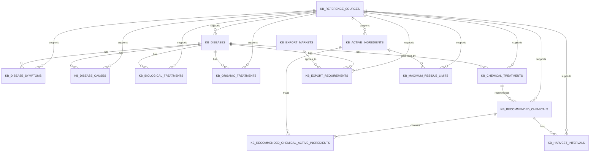

# DurianCare Agricultural Knowledge Base Design

## 1. Overall Architecture

The knowledge base is a curated agricultural domain store used by the existing AI disease detection flow after the model predicts a label.

High-level flow:

1. AI service predicts a disease label from a durian leaf image.
2. The backend resolves the label to a canonical knowledge record.
3. The knowledge base returns symptoms, causes, prevention, treatment guidance, residue warnings, and export notes.
4. The response is surfaced through the existing AI pipeline without modifying the model itself.

Design rules:

- The AI model is not retrained or changed.
- No frontend changes are required.
- No REST API changes are introduced in this milestone.
- Only verified agronomic knowledge is stored.
- If a recommendation cannot be verified, it is intentionally omitted.
- Market residue guidance is stored as compliance rules, not guessed numeric values.

## 2. Storage Scope

The knowledge base is implemented in the PostgreSQL database used by the AI service.

Logical namespaces:

- `kb_diseases`
- `kb_disease_symptoms`
- `kb_disease_causes`
- `kb_biological_treatments`
- `kb_organic_treatments`
- `kb_chemical_treatments`
- `kb_recommended_chemicals`
- `kb_active_ingredients`
- `kb_harvest_intervals`
- `kb_maximum_residue_limits`
- `kb_export_markets`
- `kb_export_requirements`
- `kb_reference_sources`

The existing AI disease detection tables remain untouched. The new knowledge base is additive and designed to be consumed after inference.

## 3. ER Diagram

## 4. Database Schema

### 4.1 Disease Master

`kb_diseases`

- Canonical knowledge entry for each AI label.
- Stores the disease or pest classification, scientific name, severity, and a short evidence-backed summary.
- Uses the model label as a stable business key.

Key fields:

- `code`
- `vietnamese_name`
- `english_name`
- `scientific_name`
- `issue_type`
- `severity`
- `favorable_conditions`
- `confidence_level`

### 4.2 Symptoms and Causes

`kb_disease_symptoms`

- One disease can have multiple symptoms.
- Symptoms are ordered and sourced.

`kb_disease_causes`

- One disease can have multiple causal notes.
- Used for fungal, algal, and pest-related diagnoses.

### 4.3 Recommendations

`kb_biological_treatments`

- Biological control guidance supported by authoritative or peer-reviewed sources.

`kb_organic_treatments`

- Cultural and organic practices such as canopy management, sanitation, pruning, and monitoring.

`kb_chemical_treatments`

- Chemical intervention only when a verified source exists.
- Safety notes, label verification, and residue caution are stored here.

`kb_recommended_chemicals`

- Product family or application strategy.

`kb_active_ingredients`

- Approved active ingredient record.

`kb_recommended_chemical_active_ingredients`

- Join table for multi-ingredient or one-to-many mappings.

`kb_harvest_intervals`

- Stores PHI guidance where the source verifies it.
- If a durable numeric PHI is not verified, the record remains intentionally blank and the manual verification note is preserved.

### 4.4 Residue and Export

`kb_maximum_residue_limits`

- Stores market-specific MRL information when verified.
- This milestone does not guess numeric values.

`kb_export_markets`

- Vietnam, China, EU, Japan.

`kb_export_requirements`

- One disease or pest can have different export notes per market.
- Rules focus on compliance, residue awareness, traceability, and safe usage.

### 4.5 References

`kb_reference_sources`

- Stores the provenance of every recommendation.
- Required metadata:
  - source name
  - source type
  - publication
  - URL
  - confidence level

## 5. Data Dictionary

### `kb_diseases`

- `code`: stable label from the AI output.
- `issue_type`: `DISEASE`, `PEST`, or `HEALTHY`.
- `severity`: `LOW`, `MEDIUM`, `HIGH`, `CRITICAL`.
- `favorable_conditions`: climate and orchard conditions that favor the issue.

### `kb_disease_symptoms`

- `symptom_text`: concise human-readable symptom statement.
- `symptom_order`: display order for UI or RAG output.

### `kb_disease_causes`

- `cause_text`: verified causal organism or causal factor.

### `kb_biological_treatments`

- `treatment_text`: biological management recommendation.
- `mechanism`: short explanation of why it is used.

### `kb_organic_treatments`

- `treatment_text`: organic / cultural practice.
- `safe_usage_note`: orchard practice note.

### `kb_chemical_treatments`

- `treatment_text`: chemical intervention statement.
- `safe_usage_note`: label, PHI, and residue caution.

### `kb_recommended_chemicals`

- `product_name`: product family or candidate product class.
- `active_ingredient_summary`: short explanation of the active ingredient use.

### `kb_active_ingredients`

- `ingredient_name`: approved active ingredient name.
- `chemical_group`: e.g. copper compound, pyrethroid.

### `kb_export_requirements`

- `requirement_text`: what must be checked before export.
- `warning_text`: residue or PHI warning.

### `kb_reference_sources`

- `source_type`: `OFFICIAL`, `DATABASE`, `PEER_REVIEWED`, `STANDARD`, `EXTENSION`.
- `confidence_level`: normalized confidence from 0.000 to 1.000.

## 6. Reference Strategy

Priority order for storing knowledge:

1. Vietnam Ministry of Agriculture and Environment / Plant Protection Department
2. Official registration or label documents approved in Vietnam
3. FAO, Codex, GlobalG.A.P., and destination-market MRL databases
4. CABI and peer-reviewed scientific literature

Rules:

- If a fact cannot be verified, it is not inserted.
- If a treatment is only supported at a general IPM level, it is stored as a preventive recommendation, not a precise field prescription.
- If a PHI or MRL cannot be verified, the record stays empty and a manual verification note is retained.
- Export advice always favors residue control, traceability, and label compliance.

## 7. Source List

The initial seed set uses authoritative references from:

- FAO IPM guidance
- FAO Codex pesticide residue database
- European Commission EU Pesticides Database
- Japan Food Chemical Research Foundation residue database
- Vietnam plant protection and pesticide regulation references
- CABI Compendium and CABI ISC datasheets
- Peer-reviewed papers on durian leaf blight, algal leaf spot, Phomopsis leaf spot, and durian psyllid control
- Official or university extension sources for conservative treatment guidance

## 8. Supported Labels Included In The Seed Data

- `ALGAL_LEAF_SPOT`
- `LEAF_BLIGHT`
- `PHOMOPSIS_LEAF_SPOT`
- `ALLOCARIDARA_ATTACK`
- `HEALTHY_LEAF`

## 9. Manual Verification Remaining

The following items are intentionally left for later verification before production rollout:

- Numeric MRL values for durian-specific destination-market combinations.
- Official Vietnam label IDs for every candidate active ingredient.
- PHI values for each active ingredient on durian, when not explicitly verified in a source.
- Any disease-specific chemical recommendation that requires a label lookup before field use.

